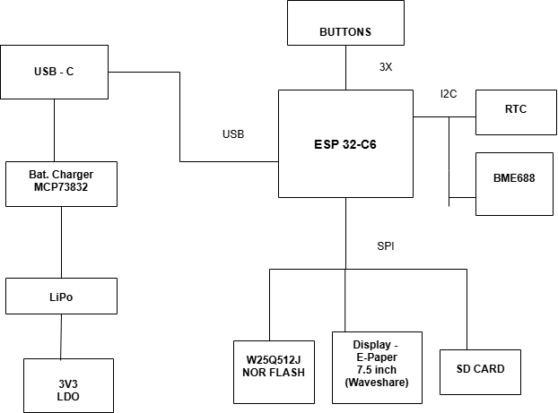
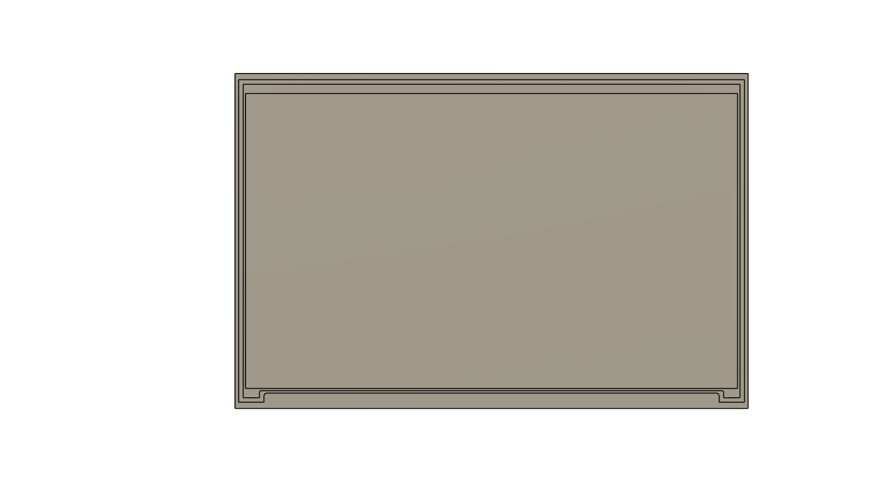

# OpenBook E-Reader

OpenBook este un e-reader open-source construit in jurul microcontrollerului ESP32-C6-WROOM-1. Dispozitivul ofera o experienta de lectura cu afisaj e-paper, butoane fizice, conectivitate wireless si senzori de mediu integrati.

## DIAGRAMA BLOC

## BOM

| DENUMIRE | SITE ACHIZITIONARE | DATASHEET |
|----------|---------------------|-----------|
| BOOT_BUTON | [https://www.snapeda.com/parts/EVQP7L01P/Panasonic%20Electronic%20Components/view-part/?welcome=home](https://www.snapeda.com/parts/EVQP7L01P/Panasonic%20Electronic%20Components/view-part/?welcome=home) | [https://www.snapeda.com/parts/EVQP7L01P/Panasonic/datasheet/](https://www.snapeda.com/parts/EVQP7L01P/Panasonic/datasheet/) |
| C1 - C10 | [https://componentsearchengine.com/part-view/CC0402MRX5R5BB106/YAGEO](https://componentsearchengine.com/part-view/CC0402MRX5R5BB106/YAGEO) | [https://componentsearchengine.com/Datasheets/2/CC0402MRX5R5BB106.pdf](https://componentsearchengine.com/Datasheets/2/CC0402MRX5R5BB106.pdf) |
| C1_BAT | [https://componentsearchengine.com/part-view/CC0402MRX5R5BB106/YAGEO](https://componentsearchengine.com/part-view/CC0402MRX5R5BB106/YAGEO) | [https://componentsearchengine.com/Datasheets/2/CC0402MRX5R5BB106.pdf](https://componentsearchengine.com/Datasheets/2/CC0402MRX5R5BB106.pdf) |
| C1_BAT2 | [https://componentsearchengine.com/part-view/CC0402MRX5R5BB106/YAGEO](https://componentsearchengine.com/part-view/CC0402MRX5R5BB106/YAGEO) | [https://componentsearchengine.com/Datasheets/2/CC0402MRX5R5BB106.pdf](https://componentsearchengine.com/Datasheets/2/CC0402MRX5R5BB106.pdf) |
| C2_BAT | [https://componentsearchengine.com/part-view/CC0402MRX5R5BB106/YAGEO](https://componentsearchengine.com/part-view/CC0402MRX5R5BB106/YAGEO) | [https://componentsearchengine.com/Datasheets/2/CC0402MRX5R5BB106.pdf](https://componentsearchengine.com/Datasheets/2/CC0402MRX5R5BB106.pdf) |
| C4_USB | [https://componentsearchengine.com/part-view/CC0402MRX5R5BB106/YAGEO](https://componentsearchengine.com/part-view/CC0402MRX5R5BB106/YAGEO) | [https://componentsearchengine.com/Datasheets/2/CC0402MRX5R5BB106.pdf](https://componentsearchengine.com/Datasheets/2/CC0402MRX5R5BB106.pdf) |
| C5_USB | [https://componentsearchengine.com/part-view/CC0402MRX5R5BB106/YAGEO](https://componentsearchengine.com/part-view/CC0402MRX5R5BB106/YAGEO) | [https://componentsearchengine.com/Datasheets/2/CC0402MRX5R5BB106.pdf](https://componentsearchengine.com/Datasheets/2/CC0402MRX5R5BB106.pdf) |
| C10_SUPERCAR | [https://industry.panasonic.com/global/en/products/control/switch/light-touch/number/evqpuj02k](https://industry.panasonic.com/global/en/products/control/switch/light-touch/number/evqpuj02k) | [https://industry.panasonic.com/global/en/downloads?tab=catalog&small_g_cd=203&part_no=EVQPUJ02K](https://industry.panasonic.com/global/en/downloads?tab=catalog&small_g_cd=203&part_no=EVQPUJ02K) |
| CHANGE_BUTTON | [https://www.snapeda.com/parts/EVQP7L01P/Panasonic%20Electronic%20Components/view-part/?welcome=home](https://www.snapeda.com/parts/EVQP7L01P/Panasonic%20Electronic%20Components/view-part/?welcome=home) | [https://www.snapeda.com/parts/EVQP7L01P/Panasonic/datasheet/](https://www.snapeda.com/parts/EVQP7L01P/Panasonic/datasheet/) |
| CHG_LED | [https://www.snapeda.com/parts/KP-1608SURCK/Kingbright/view-part/?ref=search&t=LED%200603](https://www.snapeda.com/parts/KP-1608SURCK/Kingbright/view-part/?ref=search&t=LED%200603) | [https://www.snapeda.com/parts/KP-1608SURCK/Kingbright/datasheet/](https://www.snapeda.com/parts/KP-1608SURCK/Kingbright/datasheet/) |
| C_DELAY | [https://componentsearchengine.com/part-view/CC0402MRX5R5BB106/YAGEO](https://componentsearchengine.com/part-view/CC0402MRX5R5BB106/YAGEO) | [https://componentsearchengine.com/Datasheets/2/CC0402MRX5R5BB106.pdf](https://componentsearchengine.com/Datasheets/2/CC0402MRX5R5BB106.pdf) |
| D1 | [https://www.snapeda.com/parts/USBLC6-2SC6Y/STMicroelectronics/view-part/?ref=eda](https://www.snapeda.com/parts/USBLC6-2SC6Y/STMicroelectronics/view-part/?ref=eda) | [https://www.snapeda.com/parts/USBLC6-2SC6Y/STMicroelectronics/view-part/?ref=eda](https://www.snapeda.com/parts/USBLC6-2SC6Y/STMicroelectronics/view-part/?ref=eda) |
| D2 | [https://ro.mouser.com/ProductDetail/KYOCERA-AVX/SD0805S020S1R0?qs=jCA%252BPfw4LHbpkAoSnwrdjw%3D%3D](https://ro.mouser.com/ProductDetail/KYOCERA-AVX/SD0805S020S1R0?qs=jCA%252BPfw4LHbpkAoSnwrdjw%3D%3D) | [https://ro.mouser.com/datasheet/2/40/schottky-3165252.pdf](https://ro.mouser.com/datasheet/2/40/schottky-3165252.pdf) |
| D3 | [https://ro.mouser.com/ProductDetail/KYOCERA-AVX/SD0805S020S1R0?qs=jCA%252BPfw4LHbpkAoSnwrdjw%3D%3D](https://ro.mouser.com/ProductDetail/KYOCERA-AVX/SD0805S020S1R0?qs=jCA%252BPfw4LHbpkAoSnwrdjw%3D%3D) | [https://ro.mouser.com/datasheet/2/40/schottky-3165252.pdf](https://ro.mouser.com/datasheet/2/40/schottky-3165252.pdf) |
| D4 | [https://ro.mouser.com/ProductDetail/KYOCERA-AVX/SD0805S020S1R0?qs=jCA%252BPfw4LHbpkAoSnwrdjw%3D%3D](https://ro.mouser.com/ProductDetail/KYOCERA-AVX/SD0805S020S1R0?qs=jCA%252BPfw4LHbpkAoSnwrdjw%3D%3D) | [https://ro.mouser.com/datasheet/2/40/schottky-3165252.pdf](https://ro.mouser.com/datasheet/2/40/schottky-3165252.pdf) |
| D5 | [https://ro.mouser.com/ProductDetail/KYOCERA-AVX/SD0805S020S1R0?qs=jCA%252BPfw4LHbpkAoSnwrdjw%3D%3D](https://ro.mouser.com/ProductDetail/KYOCERA-AVX/SD0805S020S1R0?qs=jCA%252BPfw4LHbpkAoSnwrdjw%3D%3D) | [https://ro.mouser.com/datasheet/2/40/schottky-3165252.pdf](https://ro.mouser.com/datasheet/2/40/schottky-3165252.pdf) |
| D6 | [https://www.snapeda.com/parts/PGB1010603MR/Littelfuse/view-part/?ref=eda](https://www.snapeda.com/parts/PGB1010603MR/Littelfuse/view-part/?ref=eda) | [https://www.snapeda.com/parts/PGB1010603MR/Littelfuse%20Inc./datasheet/](https://www.snapeda.com/parts/PGB1010603MR/Littelfuse%20Inc./datasheet/) |
| D7 | [https://ro.mouser.com/ProductDetail/KYOCERA-AVX/SD0805S020S1R0?qs=jCA%252BPfw4LHbpkAoSnwrdjw%3D%3D](https://ro.mouser.com/ProductDetail/KYOCERA-AVX/SD0805S020S1R0?qs=jCA%252BPfw4LHbpkAoSnwrdjw%3D%3D) | [https://ro.mouser.com/datasheet/2/40/schottky-3165252.pdf](https://ro.mouser.com/datasheet/2/40/schottky-3165252.pdf) |
| D8 | [https://www.snapeda.com/parts/PGB1010603MR/Littelfuse/view-part/?ref=eda](https://www.snapeda.com/parts/PGB1010603MR/Littelfuse/view-part/?ref=eda) | [https://www.snapeda.com/parts/PGB1010603MR/Littelfuse%20Inc./datasheet/](https://www.snapeda.com/parts/PGB1010603MR/Littelfuse%20Inc./datasheet/) |
| D9 | [https://www.snapeda.com/parts/PGB1010603MR/Littelfuse/view-part/?ref=eda](https://www.snapeda.com/parts/PGB1010603MR/Littelfuse/view-part/?ref=eda) | [https://www.snapeda.com/parts/PGB1010603MR/Littelfuse%20Inc./datasheet/](https://www.snapeda.com/parts/PGB1010603MR/Littelfuse%20Inc./datasheet/) |
| D10 | [https://www.snapeda.com/parts/PGB1010603MR/Littelfuse/view-part/?ref=eda](https://www.snapeda.com/parts/PGB1010603MR/Littelfuse/view-part/?ref=eda) | [https://www.snapeda.com/parts/PGB1010603MR/Littelfuse%20Inc./datasheet/](https://www.snapeda.com/parts/PGB1010603MR/Littelfuse%20Inc./datasheet/) |
| D11 | [https://www.snapeda.com/parts/PGB1010603MR/Littelfuse/view-part/?ref=eda](https://www.snapeda.com/parts/PGB1010603MR/Littelfuse/view-part/?ref=eda) | [https://www.snapeda.com/parts/PGB1010603MR/Littelfuse%20Inc./datasheet/](https://www.snapeda.com/parts/PGB1010603MR/Littelfuse%20Inc./datasheet/) |
| D12 | [https://www.snapeda.com/parts/PGB1010603MR/Littelfuse/view-part/?ref=eda](https://www.snapeda.com/parts/PGB1010603MR/Littelfuse/view-part/?ref=eda) | [https://www.snapeda.com/parts/PGB1010603MR/Littelfuse%20Inc./datasheet/](https://www.snapeda.com/parts/PGB1010603MR/Littelfuse%20Inc./datasheet/) |
| EPD_C1 - EPD_C12 | [https://componentsearchengine.com/part-view/CC0402MRX5R5BB106/YAGEO](https://componentsearchengine.com/part-view/CC0402MRX5R5BB106/YAGEO) | [https://componentsearchengine.com/Datasheets/2/CC0402MRX5R5BB106.pdf](https://componentsearchengine.com/Datasheets/2/CC0402MRX5R5BB106.pdf) |
| IC1 | [https://componentsearchengine.com/part-view/BD5229G-TR/ROHM%20Semiconductor](https://componentsearchengine.com/part-view/BD5229G-TR/ROHM%20Semiconductor) | [https://datasheet.datasheetarchive.com/originals/distributors/Datasheets_SAMA/f2b9741ef86007909f138d561a359946.pdf](https://datasheet.datasheetarchive.com/originals/distributors/Datasheets_SAMA/f2b9741ef86007909f138d561a359946.pdf) |
| IC4 | [https://componentsearchengine.com/part-view/XC6220A331MR-G/Torex](https://componentsearchengine.com/part-view/XC6220A331MR-G/Torex) | [https://product.torexsemi.com/system/files/series/xc6220.pdf](https://product.torexsemi.com/system/files/series/xc6220.pdf) |
| J1 | [https://componentsearchengine.com/part-view/FH34SRJ-24S-0.5SH(99)/Hirose](https://componentsearchengine.com/part-view/FH34SRJ-24S-0.5SH(99)/Hirose) | [https://www.hirose.com/en/product/document?clcode=CL0580-1255-6-99&productname=FH34SRJ-24S-0.5SH(99)&series=FH34SRJ&documenttype=2DDrawing&lang=en&documentid=0000990903](https://www.hirose.com/en/product/document?clcode=CL0580-1255-6-99&productname=FH34SRJ-24S-0.5SH(99)&series=FH34SRJ&documenttype=2DDrawing&lang=en&documentid=0000990903) |
| J2 | [https://componentsearchengine.com/part-view/USB4110-GF-A/GCT%20(GLOBAL%20CONNECTOR%20TECHNOLOGY)](https://componentsearchengine.com/part-view/USB4110-GF-A/GCT%20(GLOBAL%20CONNECTOR%20TECHNOLOGY)) | [https://gct.co/files/drawings/usb4110.pdf](https://gct.co/files/drawings/usb4110.pdf) |
| J3 | [https://www.snapeda.com/parts/PRT-14417/SparkFun/view-part/](https://www.snapeda.com/parts/PRT-14417/SparkFun/view-part/) | [https://www.snapeda.com/parts/PRT-14417/SparkFun%20Electronics/datasheet/](https://www.snapeda.com/parts/PRT-14417/SparkFun%20Electronics/datasheet/) |
| J4 | [https://www.snapeda.com/parts/112A-TAAR-R03/Attend/view-part/](https://www.snapeda.com/parts/112A-TAAR-R03/Attend/view-part/) | [https://www.snapeda.com/parts/112A-TAAR-R03/Attend/datasheet/](https://www.snapeda.com/parts/112A-TAAR-R03/Attend/datasheet/) |
| MCP73831 | [https://ro.mouser.com/ProductDetail/Microchip-Technology/MCP73831T-2ACI-OT?qs=yUQqVecv4qvbBQBGbHx0Mw%3D%3D&utm_id=20109199409&utm_source=google&utm_medium=cpc&utm_marketing_tactic=emeacorp&gad_source=1&gbraid=0AAAAADn_wf0-USzm1eg1ywGvQg_qMgG3H](https://ro.mouser.com/ProductDetail/Microchip-Technology/MCP73831T-2ACI-OT?qs=yUQqVecv4qvbBQBGbHx0Mw%3D%3D&utm_id=20109199409&utm_source=google&utm_medium=cpc&utm_marketing_tactic=emeacorp&gad_source=1&gbraid=0AAAAADn_wf0-USzm1eg1ywGvQg_qMgG3H) | [https://ro.mouser.com/datasheet/2/268/MCP73831_Family_Data_Sheet_DS20001984H-3441711.pdf](https://ro.mouser.com/datasheet/2/268/MCP73831_Family_Data_Sheet_DS20001984H-3441711.pdf) |
| L1 | [https://ro.mouser.com/ProductDetail/Wurth-Elektronik/744043680?qs=PGXP4M47uW6VkZq%252BkzjrHA%3D%3D](https://ro.mouser.com/ProductDetail/Wurth-Elektronik/744043680?qs=PGXP4M47uW6VkZq%252BkzjrHA%3D%3D) | [https://www.we-online.com/components/products/datasheet/744043680.pdf](https://www.we-online.com/components/products/datasheet/744043680.pdf) |
| PFMF.050.1 | [https://ro.mouser.com/ProductDetail/EPCOS-TDK/B72520T0350K062?qs=dEfas%2FXlABIszF52uu7vrg%3D%3D](https://ro.mouser.com/ProductDetail/EPCOS-TDK/B72520T0350K062?qs=dEfas%2FXlABIszF52uu7vrg%3D%3D) | [https://www.tdk-electronics.tdk.com/inf/75/db/CTVS_14/Surge_protection_series.pdf](https://www.tdk-electronics.tdk.com/inf/75/db/CTVS_14/Surge_protection_series.pdf) |
| Q1 | [https://componentsearchengine.com/part-view/DMG2305UX-7/Diodes%20Incorporated](https://componentsearchengine.com/part-view/DMG2305UX-7/Diodes%20Incorporated) | [https://www.diodes.com//assets/Datasheets/DMG2305UX.pdf](https://www.diodes.com//assets/Datasheets/DMG2305UX.pdf) |
| Q2 | [https://componentsearchengine.com/part-view/DMG2305UX-7/Diodes%20Incorporated](https://componentsearchengine.com/part-view/DMG2305UX-7/Diodes%20Incorporated) | [https://www.diodes.com//assets/Datasheets/DMG2305UX.pdf](https://www.diodes.com//assets/Datasheets/DMG2305UX.pdf) |
| Q3 | [https://componentsearchengine.com/part-view/SI1308EDL-T1-GE3/Vishay](https://componentsearchengine.com/part-view/SI1308EDL-T1-GE3/Vishay) | [https://componentsearchengine.com/part-view/SI1308EDL-T1-GE3/Vishay](https://componentsearchengine.com/part-view/SI1308EDL-T1-GE3/Vishay) |
| R1 - R10 | [https://componentsearchengine.com/part-view/R0402%201%25%20100%20K%20(RC0402FR-07100KL)/YAGEO](https://componentsearchengine.com/part-view/R0402%201%25%20100%20K%20(RC0402FR-07100KL)/YAGEO) | [https://www.yageo.com/upload/media/product/products/datasheet/rchip/PYu-RC_Group_51_RoHS_L_12.pdf](https://www.yageo.com/upload/media/product/products/datasheet/rchip/PYu-RC_Group_51_RoHS_L_12.pdf) |
| R1_PINH | [https://componentsearchengine.com/part-view/R0402%201%25%20100%20K%20(RC0402FR-07100KL)/YAGEO](https://componentsearchengine.com/part-view/R0402%201%25%20100%20K%20(RC0402FR-07100KL)/YAGEO) | [https://www.yageo.com/upload/media/product/products/datasheet/rchip/PYu-RC_Group_51_RoHS_L_12.pdf](https://www.yageo.com/upload/media/product/products/datasheet/rchip/PYu-RC_Group_51_RoHS_L_12.pdf) |
| R1_PINH1 | [https://componentsearchengine.com/part-view/R0402%201%25%20100%20K%20(RC0402FR-07100KL)/YAGEO](https://componentsearchengine.com/part-view/R0402%201%25%20100%20K%20(RC0402FR-07100KL)/YAGEO) | [https://www.yageo.com/upload/media/product/products/datasheet/rchip/PYu-RC_Group_51_RoHS_L_12.pdf](https://www.yageo.com/upload/media/product/products/datasheet/rchip/PYu-RC_Group_51_RoHS_L_12.pdf) |
| R1_BAT | [https://componentsearchengine.com/part-view/R0402%201%25%20100%20K%20(RC0402FR-07100KL)/YAGEO](https://componentsearchengine.com/part-view/R0402%201%25%20100%20K%20(RC0402FR-07100KL)/YAGEO) | [https://www.yageo.com/upload/media/product/products/datasheet/rchip/PYu-RC_Group_51_RoHS_L_12.pdf](https://www.yageo.com/upload/media/product/products/datasheet/rchip/PYu-RC_Group_51_RoHS_L_12.pdf) |
| R1_PWRUSB | [https://componentsearchengine.com/part-view/R0402%201%25%20100%20K%20(RC0402FR-07100KL)/YAGEO](https://componentsearchengine.com/part-view/R0402%201%25%20100%20K%20(RC0402FR-07100KL)/YAGEO) | [https://www.yageo.com/upload/media/product/products/datasheet/rchip/PYu-RC_Group_51_RoHS_L_12.pdf](https://www.yageo.com/upload/media/product/products/datasheet/rchip/PYu-RC_Group_51_RoHS_L_12.pdf) |
| R2_PINH | [https://componentsearchengine.com/part-view/R0402%201%25%20100%20K%20(RC0402FR-07100KL)/YAGEO](https://componentsearchengine.com/part-view/R0402%201%25%20100%20K%20(RC0402FR-07100KL)/YAGEO) | [https://www.yageo.com/upload/media/product/products/datasheet/rchip/PYu-RC_Group_51_RoHS_L_12.pdf](https://www.yageo.com/upload/media/product/products/datasheet/rchip/PYu-RC_Group_51_RoHS_L_12.pdf) |
| R2-PINH1 | [https://componentsearchengine.com/part-view/R0402%201%25%20100%20K%20(RC0402FR-07100KL)/YAGEO](https://componentsearchengine.com/part-view/R0402%201%25%20100%20K%20(RC0402FR-07100KL)/YAGEO) | [https://www.yageo.com/upload/media/product/products/datasheet/rchip/PYu-RC_Group_51_RoHS_L_12.pdf](https://www.yageo.com/upload/media/product/products/datasheet/rchip/PYu-RC_Group_51_RoHS_L_12.pdf) |
| R2_USB | [https://componentsearchengine.com/part-view/R0402%201%25%20100%20K%20(RC0402FR-07100KL)/YAGEO](https://componentsearchengine.com/part-view/R0402%201%25%20100%20K%20(RC0402FR-07100KL)/YAGEO) | [https://www.yageo.com/upload/media/product/products/datasheet/rchip/PYu-RC_Group_51_RoHS_L_12.pdf](https://www.yageo.com/upload/media/product/products/datasheet/rchip/PYu-RC_Group_51_RoHS_L_12.pdf) |
| R2_USB1 | [https://componentsearchengine.com/part-view/R0402%201%25%20100%20K%20(RC0402FR-07100KL)/YAGEO](https://componentsearchengine.com/part-view/R0402%201%25%20100%20K%20(RC0402FR-07100KL)/YAGEO) | [https://www.yageo.com/upload/media/product/products/datasheet/rchip/PYu-RC_Group_51_RoHS_L_12.pdf](https://www.yageo.com/upload/media/product/products/datasheet/rchip/PYu-RC_Group_51_RoHS_L_12.pdf) |
| RESET_BUTTON | [https://www.snapeda.com/parts/EVQP7L01P/Panasonic%20Electronic%20Components/view-part/?welcome=home](https://www.snapeda.com/parts/EVQP7L01P/Panasonic%20Electronic%20Components/view-part/?welcome=home) | [https://www.snapeda.com/parts/EVQP7L01P/Panasonic/datasheet/](https://www.snapeda.com/parts/EVQP7L01P/Panasonic/datasheet/) |
| R_BOOT | [https://componentsearchengine.com/part-view/R0402%201%25%20100%20K%20(RC0402FR-07100KL)/YAGEO](https://componentsearchengine.com/part-view/R0402%201%25%20100%20K%20(RC0402FR-07100KL)/YAGEO) | [https://www.yageo.com/upload/media/product/products/datasheet/rchip/PYu-RC_Group_51_RoHS_L_12.pdf](https://www.yageo.com/upload/media/product/products/datasheet/rchip/PYu-RC_Group_51_RoHS_L_12.pdf) |
| R_CAPACITOR | [https://componentsearchengine.com/part-view/R0402%201%25%20100%20K%20(RC0402FR-07100KL)/YAGEO](https://componentsearchengine.com/part-view/R0402%201%25%20100%20K%20(RC0402FR-07100KL)/YAGEO) | [https://www.yageo.com/upload/media/product/products/datasheet/rchip/PYu-RC_Group_51_RoHS_L_12.pdf](https://www.yageo.com/upload/media/product/products/datasheet/rchip/PYu-RC_Group_51_RoHS_L_12.pdf) |
| R_CHANGE | [https://componentsearchengine.com/part-view/R0402%201%25%20100%20K%20(RC0402FR-07100KL)/YAGEO](https://componentsearchengine.com/part-view/R0402%201%25%20100%20K%20(RC0402FR-07100KL)/YAGEO) | [https://www.yageo.com/upload/media/product/products/datasheet/rchip/PYu-RC_Group_51_RoHS_L_12.pdf](https://www.yageo.com/upload/media/product/products/datasheet/rchip/PYu-RC_Group_51_RoHS_L_12.pdf) |
| R_CL1 | [https://componentsearchengine.com/part-view/R0402%201%25%20100%20K%20(RC0402FR-07100KL)/YAGEO](https://componentsearchengine.com/part-view/R0402%201%25%20100%20K%20(RC0402FR-07100KL)/YAGEO) | [https://www.yageo.com/upload/media/product/products/datasheet/rchip/PYu-RC_Group_51_RoHS_L_12.pdf](https://www.yageo.com/upload/media/product/products/datasheet/rchip/PYu-RC_Group_51_RoHS_L_12.pdf) |
| R_RESET | [https://componentsearchengine.com/part-view/R0402%201%25%20100%20K%20(RC0402FR-07100KL)/YAGEO](https://componentsearchengine.com/part-view/R0402%201%25%20100%20K%20(RC0402FR-07100KL)/YAGEO) | [https://www.yageo.com/upload/media/product/products/datasheet/rchip/PYu-RC_Group_51_RoHS_L_12.pdf](https://www.yageo.com/upload/media/product/products/datasheet/rchip/PYu-RC_Group_51_RoHS_L_12.pdf) |
| SENSOR2 | [https://www.snapeda.com/parts/BME680/Bosch/view-part/?welcome=home](https://www.snapeda.com/parts/BME680/Bosch/view-part/?welcome=home) | [https://www.snapeda.com/parts/BME680/Bosch%20Sensortec/datasheet/](https://www.snapeda.com/parts/BME680/Bosch%20Sensortec/datasheet/) |
| TP | [nan](nan) | [nan](nan) |
| U1 | [https://www.snapeda.com/parts/W25Q512JVEIQ/Winbond+Electronics/view-part/?ref=eda](https://www.snapeda.com/parts/W25Q512JVEIQ/Winbond+Electronics/view-part/?ref=eda) | [https://www.snapeda.com/parts/W25Q512JVEIQ/Winbond+Electronics/view-part/?ref=eda](https://www.snapeda.com/parts/W25Q512JVEIQ/Winbond+Electronics/view-part/?ref=eda) |
| U2 | [https://www.snapeda.com/parts/ESP32-C6-WROOM-1-N8/Espressif+Systems/view-part/?ref=eda](https://www.snapeda.com/parts/ESP32-C6-WROOM-1-N8/Espressif+Systems/view-part/?ref=eda) | [https://www.snapeda.com/parts/ESP32-C6-WROOM-1-N8/Espressif%20Systems/datasheet/](https://www.snapeda.com/parts/ESP32-C6-WROOM-1-N8/Espressif%20Systems/datasheet/) |
| U3 | [https://www.snapeda.com/parts/DS3231SN%23/Analog+Devices/view-part/?ref=eda](https://www.snapeda.com/parts/DS3231SN%23/Analog+Devices/view-part/?ref=eda) | [https://www.snapeda.com/parts/DS3231SN%23/Analog%20Devices/datasheet/](https://www.snapeda.com/parts/DS3231SN%23/Analog%20Devices/datasheet/) |
| U4 | [https://www.snapeda.com/parts/MAX17048G+T10/Analog+Devices/view-part/?ref=eda](https://www.snapeda.com/parts/MAX17048G+T10/Analog+Devices/view-part/?ref=eda) | [https://www.snapeda.com/parts/MAX17048G+T10/Analog%20Devices/datasheet/](https://www.snapeda.com/parts/MAX17048G+T10/Analog%20Devices/datasheet/) |

## Functionalitate hardware detaliata

OpenBook este un e-reader open-source construit in jurul microcontrollerului ESP32-C6-WROOM-1-N8. Sistemul este modular si a fost gandit pentru consum redus de energie, simplitate si extensibilitate.

### Microcontroller - ESP32-C6-WROOM-1-N8
- Procesor RISC-V 32-bit, frecventa 160 MHz+
- Suport pentru Wi-Fi 6, BLE 5 si USB 2.0 FS
- Interfete disponibile: SPI, I2C, UART, GPIO
- Consum redus: aproximativ 60 mA in activ, sub 100 uA in deep sleep

### Display - E-Paper 7.5 inch (Waveshare)
- Rezolutie 800x480 alb-negru
- Interfata SPI, partajata cu alte periferice
- Foloseste linii dedicate pentru ceas, date, comenzi, reset si status
- Consum doar in timpul refreshului (~30 - 50 mA)

### Senzori de mediu
- **BME688** masoara temperatura, umiditatea, presiunea si calitatea aerului
- Conectat pe magistrala I2C, alaturi de RTC si fuel gauge
- **DS3231**  este un RTC cu backup pe supercapacitor si semnal de intrerupere catre microcontroller
- **MAX17048** (fuel gauge): I2C + ALERT pe IO16
- Un fuel gauge care poate trimite alerta in caz de nivel scazut

### Memorie externa
- W25Q512J, o memorie NOR Flash de 64MB, conectata prin SPI
- Are chip select dedicat pentru acces independent de afisaj

### SD Card (optional)
- Suportat pe aceeasi magistrala SPI cu chip select separat
- Permite extinderea capacitatii de stocare

### Butoane
- Trei butoane tactile conectate direct la pinii microcontrollerului
- Sunt folosite pentru navigare si selectie in interfata
- Gestionate prin intreruperi, cu debounce hardware si software

### Alimentare
- Sistemul este alimentat de o baterie Li-Po de 2500 mAh
- Incarcarea se face prin USB-C cu ajutorul unui MCP73831
- Un semnal digital permite monitorizarea starii de incarcare
- Tensiunea este stabilizata la 3.3V printr-un LDO

### USB-C
- Asigura incarcare si transfer de fisiere in mod MSC (Mass Storage)
- Liniile USB sunt protejate cu diode ESD

### Consum estimativ
- In activ cu Wi-Fi: intre 60 si 100 mA
- In activ fara Wi-Fi: intre 40 si 60 mA
- In standby: aproximativ 10 mA
- In deep sleep: sub 100 uA

### PCB si carcasa
- Placa in 2 straturi, rutare clara pentru alimentare si SPI
- Separare intre zonele digitale si analogice
- Carcasa ABS/PC, usoara si ergonomica

| IO Pin | Semnal     | Rol                                               |
|--------|------------|----------------------------------------------------|
| 0| |
| 1 | 32KHZ | Oscilator 32kHz pentru RTC |
| 2 | MISO | SPI MISO date de la periferice |
| 3 | EPD_BUSY | Semnal ocupat de la afisaj e-paper |
| 4 | SS_SD | Chip Select pentru SD Card |
| 5 | EPD_DC | Comanda date/controle pentru e-paper |
| 6 | SCK | SPI Clock comun pentru SD, flash si e-paper |
| 7 | MOSI | SPI MOSI date catre SD, flash, e-paper |
| 8 | EPD_CS | Chip Select pentru afisaj e-paper |
| 9 | IO/BOOT |  |
| 10 | INT_RTC | Semnal de intrerupere de la RTC |
| 11 | FLASH_CS | Chip Select pentru flash NOR |
| 12 |  | |
| 13 | USB_D- | Linie pozitiva pentru USB Full-Speed |
| 14 | USB_D+ | Linie negativa pentru USB Full-Speed |
| 15 |  | |
| 16 | TX | Debug |
| 17 | RX | Debug |
| 18 | RTC_RST | Reset pentru modulul RTC|
| 19 |  |  |
| 20 |  |  |
| 21 | SDA | I2C SDA conexiune alternativa RTC |
| 22 | SCL | I2C SCL conexiune alternativa RTC |
| 23 | EPD_RST | Reset alternativ e-paper display |

## Imagini

