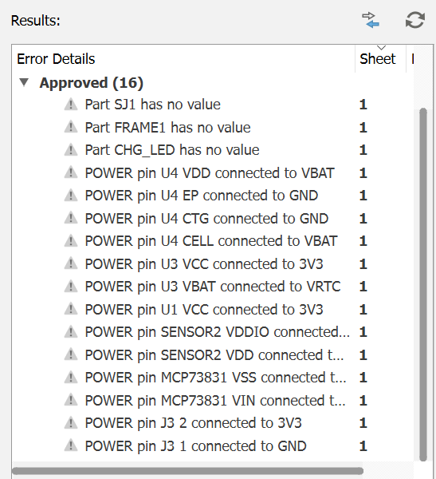
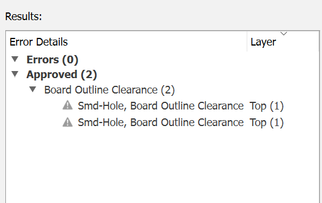

# OpenBook E-Reader

OpenBook este un e-reader open-source construit in jurul microcontrollerului ESP32-C6-WROOM-1. Dispozitivul ofera o experienta de lectura cu afisaj e-paper, butoane fizice, conectivitate wireless si senzori de mediu integrati.

## DIAGRAMA BLOC

## BOM

| DENUMIRE | SITE ACHIZITIONARE | DATASHEET |
|----------|---------------------|-----------|
| BOOT_BUTON | [LINK](https://www.snapeda.com/parts/EVQP7L01P/Panasonic%20Electronic%20Components/view-part/?welcome=home) | [LINK](https://www.snapeda.com/parts/EVQP7L01P/Panasonic/datasheet/) |
| C1 - C10 | [LINK](https://componentsearchengine.com/part-view/CC0402MRX5R5BB106/YAGEO) | [LINK](https://componentsearchengine.com/Datasheets/2/CC0402MRX5R5BB106.pdf) |
| C1_BAT | [LINK](https://componentsearchengine.com/part-view/CC0402MRX5R5BB106/YAGEO) | [LINK](https://componentsearchengine.com/Datasheets/2/CC0402MRX5R5BB106.pdf) |
| C1_BAT2 | [LINK](https://componentsearchengine.com/part-view/CC0402MRX5R5BB106/YAGEO) | [LINK](https://componentsearchengine.com/Datasheets/2/CC0402MRX5R5BB106.pdf) |
| C2_BAT | [LINK](https://componentsearchengine.com/part-view/CC0402MRX5R5BB106/YAGEO) | [LINK](https://componentsearchengine.com/Datasheets/2/CC0402MRX5R5BB106.pdf) |
| C4_USB | [LINK](https://componentsearchengine.com/part-view/CC0402MRX5R5BB106/YAGEO) | [LINK](https://componentsearchengine.com/Datasheets/2/CC0402MRX5R5BB106.pdf) |
| C5_USB | [LINK](https://componentsearchengine.com/part-view/CC0402MRX5R5BB106/YAGEO) | [LINK](https://componentsearchengine.com/Datasheets/2/CC0402MRX5R5BB106.pdf) |
| C10_SUPERCAR | [LINK](https://industry.panasonic.com/global/en/products/control/switch/light-touch/number/evqpuj02k) | [LINK](https://industry.panasonic.com/global/en/downloads?tab=catalog&small_g_cd=203&part_no=EVQPUJ02K) |
| CHANGE_BUTTON | [LINK](https://www.snapeda.com/parts/EVQP7L01P/Panasonic%20Electronic%20Components/view-part/?welcome=home) | [LINK](https://www.snapeda.com/parts/EVQP7L01P/Panasonic/datasheet/) |
| CHG_LED | [LINK](https://www.snapeda.com/parts/KP-1608SURCK/Kingbright/view-part/?ref=search&t=LED%200603) | [LINK](https://www.snapeda.com/parts/KP-1608SURCK/Kingbright/datasheet/) |
| C_DELAY | [LINK](https://componentsearchengine.com/part-view/CC0402MRX5R5BB106/YAGEO) | [LINK](https://componentsearchengine.com/Datasheets/2/CC0402MRX5R5BB106.pdf) |
| D1 | [LINK](https://www.snapeda.com/parts/USBLC6-2SC6Y/STMicroelectronics/view-part/?ref=eda) | [LINK](https://www.snapeda.com/parts/USBLC6-2SC6Y/STMicroelectronics/view-part/?ref=eda) |
| D2 | [LINK](https://ro.mouser.com/ProductDetail/KYOCERA-AVX/SD0805S020S1R0?qs=jCA%252BPfw4LHbpkAoSnwrdjw%3D%3D) | [LINK](https://ro.mouser.com/datasheet/2/40/schottky-3165252.pdf) |
| D3 | [LINK](https://ro.mouser.com/ProductDetail/KYOCERA-AVX/SD0805S020S1R0?qs=jCA%252BPfw4LHbpkAoSnwrdjw%3D%3D) | [LINK](https://ro.mouser.com/datasheet/2/40/schottky-3165252.pdf) |
| D4 | [LINK](https://ro.mouser.com/ProductDetail/KYOCERA-AVX/SD0805S020S1R0?qs=jCA%252BPfw4LHbpkAoSnwrdjw%3D%3D) | [LINK](https://ro.mouser.com/datasheet/2/40/schottky-3165252.pdf) |
| D5 | [LINK](https://ro.mouser.com/ProductDetail/KYOCERA-AVX/SD0805S020S1R0?qs=jCA%252BPfw4LHbpkAoSnwrdjw%3D%3D) | [LINK](https://ro.mouser.com/datasheet/2/40/schottky-3165252.pdf) |
| D6 | [LINK](https://www.snapeda.com/parts/PGB1010603MR/Littelfuse/view-part/?ref=eda) | [LINK](https://www.snapeda.com/parts/PGB1010603MR/Littelfuse%20Inc./datasheet/) |
| D7 | [LINK](https://ro.mouser.com/ProductDetail/KYOCERA-AVX/SD0805S020S1R0?qs=jCA%252BPfw4LHbpkAoSnwrdjw%3D%3D) | [LINK](https://ro.mouser.com/datasheet/2/40/schottky-3165252.pdf) |
| D8 | [LINK](https://www.snapeda.com/parts/PGB1010603MR/Littelfuse/view-part/?ref=eda) | [LINK](https://www.snapeda.com/parts/PGB1010603MR/Littelfuse%20Inc./datasheet/) |
| D9 | [LINK](https://www.snapeda.com/parts/PGB1010603MR/Littelfuse/view-part/?ref=eda) | [LINK](https://www.snapeda.com/parts/PGB1010603MR/Littelfuse%20Inc./datasheet/) |
| D10 | [LINK](https://www.snapeda.com/parts/PGB1010603MR/Littelfuse/view-part/?ref=eda) | [LINK](https://www.snapeda.com/parts/PGB1010603MR/Littelfuse%20Inc./datasheet/) |
| D11 | [LINK](https://www.snapeda.com/parts/PGB1010603MR/Littelfuse/view-part/?ref=eda) | [LINK](https://www.snapeda.com/parts/PGB1010603MR/Littelfuse%20Inc./datasheet/) |
| D12 | [LINK](https://www.snapeda.com/parts/PGB1010603MR/Littelfuse/view-part/?ref=eda) | [LINK](https://www.snapeda.com/parts/PGB1010603MR/Littelfuse%20Inc./datasheet/) |
| EPD_C1 - EPD_C12 | [LINK](https://componentsearchengine.com/part-view/CC0402MRX5R5BB106/YAGEO) | [LINK](https://componentsearchengine.com/Datasheets/2/CC0402MRX5R5BB106.pdf) |
| IC1 | [LINK](https://componentsearchengine.com/part-view/BD5229G-TR/ROHM%20Semiconductor) | [LINK](https://datasheet.datasheetarchive.com/originals/distributors/Datasheets_SAMA/f2b9741ef86007909f138d561a359946.pdf) |
| IC4 | [LINK](https://componentsearchengine.com/part-view/XC6220A331MR-G/Torex) | [LINK](https://product.torexsemi.com/system/files/series/xc6220.pdf) |
| J1 | [LINK](https://componentsearchengine.com/part-view/FH34SRJ-24S-0.5SH(99)/Hirose) | [LINK](https://www.hirose.com/en/product/document?clcode=CL0580-1255-6-99&productname=FH34SRJ-24S-0.5SH(99)&series=FH34SRJ&documenttype=2DDrawing&lang=en&documentid=0000990903) |
| J2 | [LINK](https://componentsearchengine.com/part-view/USB4110-GF-A/GCT%20(GLOBAL%20CONNECTOR%20TECHNOLOGY)) | [LINK](https://gct.co/files/drawings/usb4110.pdf) |
| J3 | [LINK](https://www.snapeda.com/parts/PRT-14417/SparkFun/view-part/) | [LINK](https://www.snapeda.com/parts/PRT-14417/SparkFun%20Electronics/datasheet/) |
| J4 | [LINK](https://www.snapeda.com/parts/112A-TAAR-R03/Attend/view-part/) | [LINK](https://www.snapeda.com/parts/112A-TAAR-R03/Attend/datasheet/) |
| MCP73831 | [LINK](https://ro.mouser.com/ProductDetail/Microchip-Technology/MCP73831T-2ACI-OT?qs=yUQqVecv4qvbBQBGbHx0Mw%3D%3D&utm_id=20109199409&utm_source=google&utm_medium=cpc&utm_marketing_tactic=emeacorp&gad_source=1&gbraid=0AAAAADn_wf0-USzm1eg1ywGvQg_qMgG3H) | [LINK](https://ro.mouser.com/datasheet/2/268/MCP73831_Family_Data_Sheet_DS20001984H-3441711.pdf) |
| L1 | [LINK](https://ro.mouser.com/ProductDetail/Wurth-Elektronik/744043680?qs=PGXP4M47uW6VkZq%252BkzjrHA%3D%3D) | [LINK](https://www.we-online.com/components/products/datasheet/744043680.pdf) |
| PFMF.050.1 | [LINK](https://ro.mouser.com/ProductDetail/EPCOS-TDK/B72520T0350K062?qs=dEfas%2FXlABIszF52uu7vrg%3D%3D) | [LINK](https://www.tdk-electronics.tdk.com/inf/75/db/CTVS_14/Surge_protection_series.pdf) |
| Q1 | [LINK](https://componentsearchengine.com/part-view/DMG2305UX-7/Diodes%20Incorporated) | [LINK](https://www.diodes.com//assets/Datasheets/DMG2305UX.pdf) |
| Q2 | [LINK](https://componentsearchengine.com/part-view/DMG2305UX-7/Diodes%20Incorporated) | [LINK](https://www.diodes.com//assets/Datasheets/DMG2305UX.pdf) |
| Q3 | [LINK](https://componentsearchengine.com/part-view/SI1308EDL-T1-GE3/Vishay) | [LINK](https://componentsearchengine.com/part-view/SI1308EDL-T1-GE3/Vishay) |
| R1 - R10 | [LINK](https://componentsearchengine.com/part-view/R0402%201%25%20100%20K%20(RC0402FR-07100KL)/YAGEO) | [LINK](https://www.yageo.com/upload/media/product/products/datasheet/rchip/PYu-RC_Group_51_RoHS_L_12.pdf) |
| R1_PINH | [LINK](https://componentsearchengine.com/part-view/R0402%201%25%20100%20K%20(RC0402FR-07100KL)/YAGEO) | [LINK](https://www.yageo.com/upload/media/product/products/datasheet/rchip/PYu-RC_Group_51_RoHS_L_12.pdf) |
| R1_PINH1 | [LINK](https://componentsearchengine.com/part-view/R0402%201%25%20100%20K%20(RC0402FR-07100KL)/YAGEO) | [LINK](https://www.yageo.com/upload/media/product/products/datasheet/rchip/PYu-RC_Group_51_RoHS_L_12.pdf) |
| R1_BAT | [LINK](https://componentsearchengine.com/part-view/R0402%201%25%20100%20K%20(RC0402FR-07100KL)/YAGEO) | [LINK](https://www.yageo.com/upload/media/product/products/datasheet/rchip/PYu-RC_Group_51_RoHS_L_12.pdf) |
| R1_PWRUSB | [LINK](https://componentsearchengine.com/part-view/R0402%201%25%20100%20K%20(RC0402FR-07100KL)/YAGEO) | [LINK](https://www.yageo.com/upload/media/product/products/datasheet/rchip/PYu-RC_Group_51_RoHS_L_12.pdf) |
| R2_PINH | [LINK](https://componentsearchengine.com/part-view/R0402%201%25%20100%20K%20(RC0402FR-07100KL)/YAGEO) | [LINK](https://www.yageo.com/upload/media/product/products/datasheet/rchip/PYu-RC_Group_51_RoHS_L_12.pdf) |
| R2-PINH1 | [LINK](https://componentsearchengine.com/part-view/R0402%201%25%20100%20K%20(RC0402FR-07100KL)/YAGEO) | [LINK](https://www.yageo.com/upload/media/product/products/datasheet/rchip/PYu-RC_Group_51_RoHS_L_12.pdf) |
| R2_USB | [LINK](https://componentsearchengine.com/part-view/R0402%201%25%20100%20K%20(RC0402FR-07100KL)/YAGEO) | [LINK](https://www.yageo.com/upload/media/product/products/datasheet/rchip/PYu-RC_Group_51_RoHS_L_12.pdf) |
| R2_USB1 | [LINK](https://componentsearchengine.com/part-view/R0402%201%25%20100%20K%20(RC0402FR-07100KL)/YAGEO) | [LINK](https://www.yageo.com/upload/media/product/products/datasheet/rchip/PYu-RC_Group_51_RoHS_L_12.pdf) |
| RESET_BUTTON | [LINK](https://www.snapeda.com/parts/EVQP7L01P/Panasonic%20Electronic%20Components/view-part/?welcome=home) | [LINK](https://www.snapeda.com/parts/EVQP7L01P/Panasonic/datasheet/) |
| R_BOOT | [LINK](https://componentsearchengine.com/part-view/R0402%201%25%20100%20K%20(RC0402FR-07100KL)/YAGEO) | [LINK](https://www.yageo.com/upload/media/product/products/datasheet/rchip/PYu-RC_Group_51_RoHS_L_12.pdf) |
| R_CAPACITOR | [LINK](https://componentsearchengine.com/part-view/R0402%201%25%20100%20K%20(RC0402FR-07100KL)/YAGEO) | [LINK](https://www.yageo.com/upload/media/product/products/datasheet/rchip/PYu-RC_Group_51_RoHS_L_12.pdf) |
| R_CHANGE | [LINK](https://componentsearchengine.com/part-view/R0402%201%25%20100%20K%20(RC0402FR-07100KL)/YAGEO) | [LINK](https://www.yageo.com/upload/media/product/products/datasheet/rchip/PYu-RC_Group_51_RoHS_L_12.pdf) |
| R_CL1 | [LINK](https://componentsearchengine.com/part-view/R0402%201%25%20100%20K%20(RC0402FR-07100KL)/YAGEO) | [LINK](https://www.yageo.com/upload/media/product/products/datasheet/rchip/PYu-RC_Group_51_RoHS_L_12.pdf) |
| R_RESET | [LINK](https://componentsearchengine.com/part-view/R0402%201%25%20100%20K%20(RC0402FR-07100KL)/YAGEO) | [LINK](https://www.yageo.com/upload/media/product/products/datasheet/rchip/PYu-RC_Group_51_RoHS_L_12.pdf) |
| SENSOR2 | [LINK](https://www.snapeda.com/parts/BME680/Bosch/view-part/?welcome=home) | [LINK](https://www.snapeda.com/parts/BME680/Bosch%20Sensortec/datasheet/) |
| TP | [nan](nan) | [nan](nan) |
| U1 | [LINK](https://www.snapeda.com/parts/W25Q512JVEIQ/Winbond+Electronics/view-part/?ref=eda) | [LINK](https://www.snapeda.com/parts/W25Q512JVEIQ/Winbond+Electronics/view-part/?ref=eda) |
| U2 | [LINK](https://www.snapeda.com/parts/ESP32-C6-WROOM-1-N8/Espressif+Systems/view-part/?ref=eda) | [LINK](https://www.snapeda.com/parts/ESP32-C6-WROOM-1-N8/Espressif%20Systems/datasheet/) |
| U3 | [LINK](https://www.snapeda.com/parts/DS3231SN%23/Analog+Devices/view-part/?ref=eda) | [LINK](https://www.snapeda.com/parts/DS3231SN%23/Analog%20Devices/datasheet/) |
| U4 | [LINK](https://www.snapeda.com/parts/MAX17048G+T10/Analog+Devices/view-part/?ref=eda) | [LINK ](https://www.snapeda.com/parts/MAX17048G+T10/Analog%20Devices/datasheet/) |

## Functionalitate hardware detaliata

OpenBook este un e-reader open-source construit in jurul microcontrollerului ESP32-C6-WROOM-1-N8. Sistemul este modular si a fost gandit pentru consum redus de energie, simplitate si extensibilitate.

### Microcontroller - ESP32-C6-WROOM-1-N8
- Procesor RISC-V 32-bit, frecventa 160 MHz+
- Suport pentru Wi-Fi 6, BLE 5 si USB 2.0 FS
- Interfete disponibile: SPI, I2C, UART, GPIO
- Consum redus: aproximativ 60 mA in activ, sub 100 uA in deep sleep

### Display - E-Paper 7.5 inch (Waveshare)
- Rezolutie 800x480 alb-negru
- Interfata SPI, partajata cu alte periferice
- Foloseste linii dedicate pentru ceas, date, comenzi, reset si status
- Consum doar in timpul refreshului (~30 - 50 mA)

### Senzori de mediu
- **BME688** masoara temperatura, umiditatea, presiunea si calitatea aerului
- Conectat pe magistrala I2C, alaturi de RTC si fuel gauge
- **DS3231**  este un RTC cu backup pe supercapacitor si semnal de intrerupere catre microcontroller
- **MAX17048** (fuel gauge): I2C + ALERT pe IO16
- Un fuel gauge care poate trimite alerta in caz de nivel scazut

### Memorie externa
- W25Q512J, o memorie NOR Flash de 64MB, conectata prin SPI
- Are chip select dedicat pentru acces independent de afisaj

### SD Card (optional)
- Suportat pe aceeasi magistrala SPI cu chip select separat
- Permite extinderea capacitatii de stocare

### Butoane
- Trei butoane tactile conectate direct la pinii microcontrollerului
- Sunt folosite pentru navigare si selectie in interfata
- Gestionate prin intreruperi, cu debounce hardware si software

### Alimentare
- Sistemul este alimentat de o baterie Li-Po de 2500 mAh
- Incarcarea se face prin USB-C cu ajutorul unui MCP73831
- Un semnal digital permite monitorizarea starii de incarcare
- Tensiunea este stabilizata la 3.3V printr-un LDO

### USB-C
- Asigura incarcare si transfer de fisiere in mod MSC (Mass Storage)
- Liniile USB sunt protejate cu diode ESD

### Consum estimativ
- In activ cu Wi-Fi: intre 60 si 100 mA
- In activ fara Wi-Fi: intre 40 si 60 mA
- In standby: aproximativ 10 mA
- In deep sleep: sub 100 uA

### PCB si carcasa
- Placa in 2 straturi, rutare clara pentru alimentare si SPI
- Separare intre zonele digitale si analogice
- Carcasa ABS/PC, usoara si ergonomica

| IO Pin | Semnal     | Rol                                               |
|--------|------------|----------------------------------------------------|
| EN | RESET  | Semnal de intrare pentru resetare |
| 0| INT_RTC | Semnal de intrerupere generat de modulul RTC |
| 1 | 32KHZ | Oscilator 32kHz pentru RTC |
| 2 | MISO | SPI MISO date de la periferice |
| 3 | EPD_BUSY | Semnal ocupat de la afisaj e-paper |
| 4 | SS_SD | Chip Select pentru SD Card |
| 5 | EPD_DC | Comanda date/controle pentru e-paper |
| 6 | SCK | SPI Clock comun pentru SD, flash si e-paper |
| 7 | MOSI | SPI MOSI date catre SD, flash, e-paper |
| 8 | GPIO8 | Selectarea cardului SD |
| 9 | IO/BOOT | Mod de boot selectabil |
| 10 | EPD_CS | Chip Select pentru afisaj e-paper |
| 11 | FLASH_CS | Chip Select pentru flash NOR |
| 12 | USB_D- | Linie pozitiva pentru USB Full-Speed |
| 13 | USB_D+ | Linie pozitiva pentru USB Full-Speed |
| 14 | NEUTILIZAT | NEUTILIZAT |
| 15 | IO/CHANGE | Detectarea modificarii starii |
| 16 | TX | Debug |
| 17 | RX | Debug |
| 18 | RTC_RST | Reset pentru modulul RTC|
| 19 | I2C_PW | Gestionarea alimentarii pentru dispozitivele I2C |
| 20 | EPD_3V3_C | Gestionarea alimentarii display-ului |
| 21 | SDA | I2C SDA conexiune alternativa RTC |
| 22 | SCL | I2C SCL conexiune alternativa RTC |
| 23 | EPD_RST | Reset alternativ e-paper display |

## Erori

Am aprobat erorile din schematic deoarece alimentarile sunt corecte din punct de vedere hardware.

Am aprobat erorile de DRC aparute la mufa USB din cauza celor doua gauri, deoarece acestea sunt conforme cu specificatiile
mecanice ale mufei si nu afecteaza functionalitatea.

## Imagini

